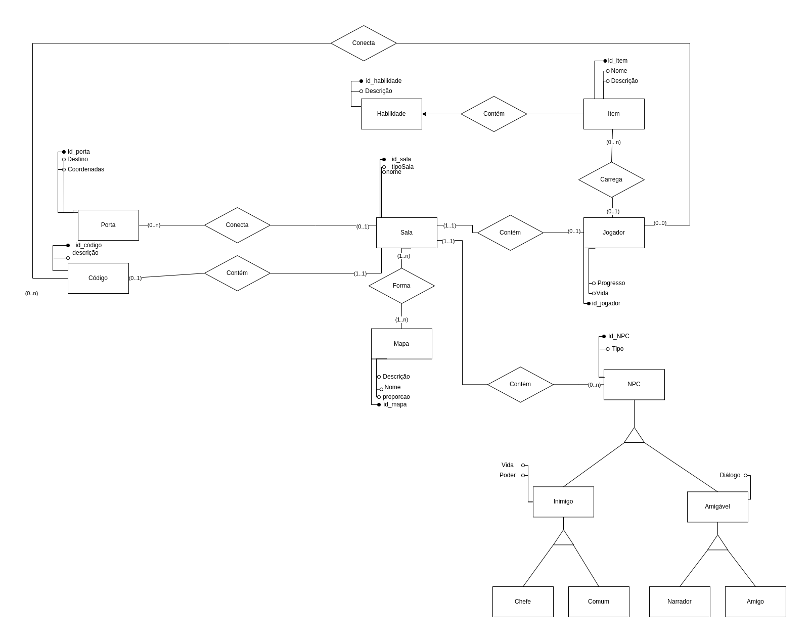

# DER - Diagrama Entidade Relacionamento

O Diagrama Entidade Relacionamento (DER) é uma ferramenta utilizada na modelagem de bancos de dados e possui o objetivo de abstrair do mundo real entidades, "coisas" que possuem carater semelhante, e os relacionamentos entre elas.

## Diagrama

### Versão 1.0

  

### Versão 2.0 Normalizada

    
 

 
### Versão 3.0 Normalizada - Final

    
 

