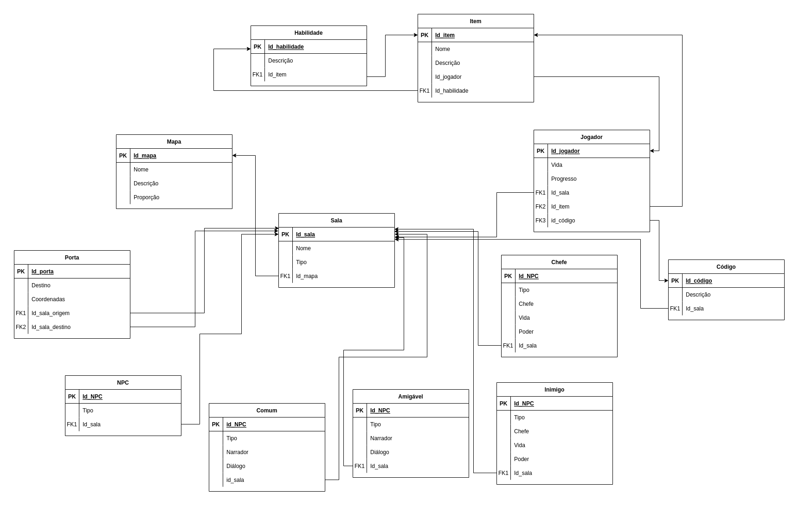

# MREL - Model Relacional

O modelo relacional é um modelo de dados representativos, adequado a ser o modelo subjacente de um Sistema Gerenciador de Banco de Dados(SGBD), que se baseia no princípio em que todos os dados estão guardados em tabelas. Toda sua definição é teórica e baseada na lógica de predicados e na teoria dos conjuntos.

## Diagrama

### Versão 1.0 

  

### Versão 2.0 Normalizada

  

### Versão 3.0 Normalizada - Final

  

